# CodeGraph：为 AI 编程时代打造的代码知识图谱引擎

> **发布时间**：2026 年 6 月
> **作者**：CodeGraph 团队
> **标签**：#AI编程 #代码智能 #MCP #知识图谱 #工程效能

---

## 前言
相比官方版本的CodeGraph，该版本做了以下功能增强及优化：
> **1、CodeBuddy支持**：CodeBuddy官方版默认不支持CodeBuddy，当前版本做了优化支持。
>
>  **2、Web控制台可视化**：官方版不支持控制台可视化，通过可视化控制台能够实时的看到缓存命中率。
>
>  **3、国产模型支持优化**：国产模型默认更倾向 grep，对 MCP instructions 遵循度不像Claude等模板那么高，通过强指令提升国产模型对MCP的支持。

由于改动实在太大，已经合不回官方版，通过全集npm install -g @xuefadevdev/codegraph进行安装，详细使用说明见章节六。

---

## 引言：当 AI 开始写代码，探索代码的方式也该变了

想象一个场景：你打开 AI 编程助手，问它"数据库连接池的配置入口在哪？"——然后 AI 开始了一场漫长的"考古"：

> `grep "pool"` → 匹配了 200 个文件  
> `Read src/config/database.ts` → 1500 行全文进入对话  
> `grep "createPool"` → 再匹配 45 个文件  
> `Read 5 个关键文件` → 又是几千行源码  
> …（经过 23 次工具调用、塞进 140 万 tokens 上下文后）…
> "数据库连接池在 `DatabaseConfig` 类中，通过 `createPool` 方法初始化……"

这个过程不仅慢、贵，而且**把大量无关代码喂给大模型，反而增加了幻觉风险**。

**CodeGraph 要做的，就是从根本上改变这种"逐行阅读-全文填充"的探索方式**——把整个代码库预先索引成一个**可查询的知识图谱**，让 AI 像查字典一样精准、快速地找到答案。

---

## 一、CodeGraph 是什么？

**一句话定义**：CodeGraph 是一个基于 [tree-sitter](https://tree-sitter.github.io/) AST（抽象语法树）的**本地化代码知识图谱 MCP 服务器**。

它不是另一个代码搜索引擎，也不是又一个代码索引器。CodeGraph 的核心差异在于：

1. **预先索引**：在 AI 发起对话之前，就把整个项目的代码结构解析成结构化数据（节点 = 符号定义、边 = 符号间的关系）
2. **图谱查询**：AI 通过标准的 MCP（Model Context Protocol）工具协议，1-3 次结构化查询就能拿到"代码全景视图"
3. **完全本地**：所有索引数据存储在项目本地的 SQLite 文件中（`.codegraph/codegraph.db`），不依赖任何云端服务

它支持的 AI 编程工具包括：
- **Claude Code**（Anthropic）
- **Cursor**（SaaS IDE）
- **Codex CLI**（OpenAI）
- **opencode**（开源）
- **CodeBuddy IDE**（腾讯内部 IDE，我们专项适配）

以 VS Code 这种约 1 万个源码文件的大型项目为例，用 CodeGraph 替代传统的 grep + 逐文件阅读，AI 探索代码的效率变化如下：

| 指标 | 不用 CodeGraph | 用 CodeGraph | 节省 |
|------|---------------|-------------|------|
| 工具调用次数 | **23 次** | **7 次** | ↓ 70% |
| 输入 tokens | **1,400,000** | **393,000** | ↓ 72% |
| 单次回答成本 | **$0.64** | **$0.42** | ↓ 35% |
| 响应时间 | **1 分 43 秒** | **1 分 0 秒** | ↓ 42% |
| 答案质量 | 基本正确 | 更结构化 | 持平或更优 |

---

## 二、CodeGraph 的核心特性

### 2.1 五层处理管道（Pipeline）

CodeGraph 的内部架构可以理解为一个"五级加工流水线"：

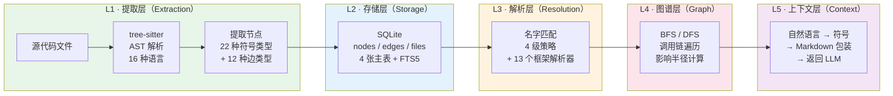

- **L1 提取层**：使用 tree-sitter 解析 16 种编程语言的源码，从中提取**符号**（类、函数、方法、接口、枚举等共 22 种类型）和**关系**（调用、导入、继承、实现等共 12 种类型）
- **L2 存储层**：将提取结果写入 SQLite 数据库，建立 FTS5 全文搜索引擎索引
- **L3 解析层**：用 4 级解析策略（从 import 精确匹配到文件名模糊匹配）建立符号间的调用关系，置信度 0.4~0.95 不等
- **L4 图谱层**：实现 BFS/DFS 图遍历，支持调用链追踪、影响半径计算等图算法
- **L5 上下文层**：用自然语言查询匹配相关符号，打包成结构化 Markdown 返回给 LLM

### 2.2 框架感知的解析器

CodeGraph 不是简单的"语法解析器"——它**理解现代 Web 框架的约定**。内置了 13 个框架的专用解析器：

| 框架 | 源码行数 | 解决的问题 |
|------|---------|-----------|
| **NestJS** | 438 行 | `@Controller` + `@Get/@Post` HTTP 路由、GraphQL Resolver、微服务 `@MessagePattern` |
| **Vue / Nuxt** | 338 行 | `<script setup>`、文件路由、API 中间件 |
| **React Router** | 309 行 | 路由组件层级 |
| **Spring Boot** | 206 行 | `@GetMapping`、`@RequestMapping` 注解路由 |
| **Laravel** | 288 行 | `Route::get()`、Controller@action 声明式路由 |
| **Django / Flask / FastAPI** | 297 行 | URL → view 函数绑定 |
| **Axum / Actix / Rocket** | 239 行 | Rust 的 `.route("/x", get(handler))` |

这意味着当你问"用户注册接口是如何实现的"，CodeGraph 能直接路由到正确的 Controller/Handler 方法，而不需要 AI 自己去 grep "register" 再猜测哪一个是入口。

### 2.3 信任信号系统（Trust Signals）

这是 CodeGraph 最独特的设计之一。CodeGraph 中的边（关系）有三类来源：

- **`tree-sitter`**：直接从 AST 精确解析（置信度 0.9~0.95）
- **`heuristic`**：启发式名字匹配（置信度 0.4~0.95）
- **`scip`**：语义索引（预留，待集成）

每种边都带有 **provenance（来源标记）** 和 **confidence（置信度）**，AI 在查看调用关系时能看到：

```
✅ UserController.createUser (src/api/user.ts:24) [tree-sitter, conf:0.95]
⚠️  UserService.sendEmail (src/services/mail.ts:88) [heuristic, conf:0.6]
```

AI 可以据此决策：高置信度的边可以直接采信，低置信度的边需要人工核对。

此外，每次查询的响应末尾还带有**索引时效性提示**：

```
_Index updated 5 minutes ago ✓_
——或——
⚠️ Uncommitted changes since last index — run `codegraph sync`
```

这让 AI 能够感知"索引是否已经落后于代码变更"，从而及时建议用户同步索引。

### 2.4 文档分块搜索

CodeGraph 不仅能索引代码，还能索引项目文档（`.md`、`.txt` 文件）。新增的 `codegraph_docs` 工具支持三种模式：

| 模式 | 功能 | Token 节省 |
|------|------|-----------|
| **search** | FTS5 关键词搜索，返回相关段落 | ~87% |
| **outline** | 查看文档的目录结构（不返回正文） | ~93% |
| **read** | 精确读取某个章节及其子章节 | ~92% |

文档按标题（Markdown heading）分块存储在 SQLite 中，支持增量更新和自动同步。

---

## 三、技术实现的关键决策

### 3.1 数据模型

CodeGraph 有 4 张核心数据表：

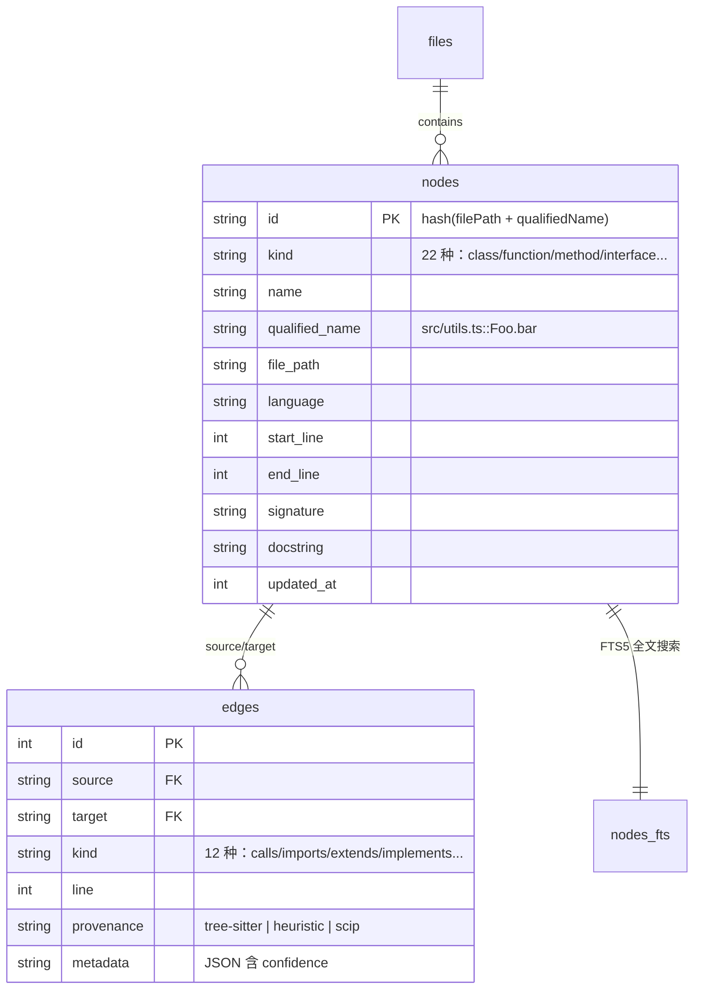

### 3.2 16 种语言的质量分级

CodeGraph 支持 16 种编程语言，但**不同语言的解析精度不同**（这取决于各语言的 tree-sitter 语法完善程度和 extractor 的投入）：

| 等级 | 语言 | 说明 |
|------|------|------|
| ⭐⭐⭐⭐⭐ | TypeScript, Go | 标杆质量，框架支持最全 |
| ⭐⭐⭐⭐ | JavaScript, Python, Java, Rust | 主要语言的 OO 多态有基本限制 |
| ⭐⭐⭐ | Kotlin, Scala, C#, PHP, C/C++ | 有已知覆盖盲区（扩展函数、宏展开等） |
| ⭐⭐ | Ruby | 元编程重灾区 |
| ⭐⭐⭐ | Vue/Svelte 等 | 自研 extractor，通过文本切割 + 嵌入 TS/JS 解析 |

### 3.3 自动同步机制

CodeGraph 通过**双重机制**保证索引始终与代码同步：

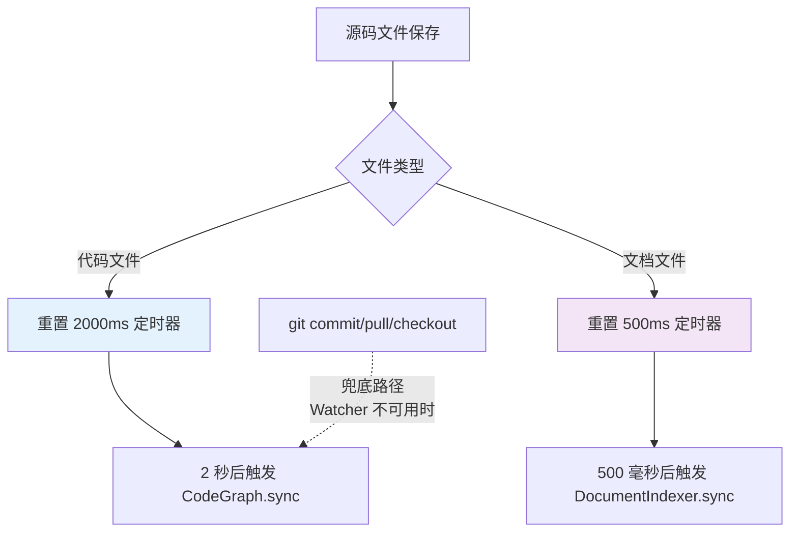

- **主路径**：基于 OS 文件系统事件（FSEvents/inotify）的实时 watcher，代码变更 2 秒后自动重索引
- **兜底路径**：Git hooks（`post-commit` / `post-merge` / `post-checkout`），在 WSL2 等 watcher 不可用环境下保底

### 3.4 Node 版本适配与内存溢出解决

CodeGraph 在工程实践中解决了几个"看不见但致命"的问题。

**问题一：V8 turboshaft WASM 编译 Zone OOM**

在 Node 24+ 版本上，tree-sitter 的 WASM 语法解析会触发 V8 turboshaft 编译器在后台优化 WASM 函数，分配大量编译 Zone 内存。当项目文件数超过 300 时，会 100% 触发 `Fatal process out of memory: Zone` 崩溃。

我们最初的修复尝试——缩短 worker 回收周期——反而因为更频繁地创建新 worker（每次新 worker 都需要重新编译所有语法）而**放大了问题**。

最终解决方案是**进程自举（re-exec）**：在检测到 Node 24+ 环境时，通过 `child_process.spawn` 重新启动自身子进程，命令行传入 `--liftoff-only` 标志，强制 V8 只用 Liftoff baseline 编译器处理 WASM（完全绕过 turboshaft 编译 Zone）。

```
检测到 Node 24+ → spawn 子进程 → --liftoff-only → WASM编译安全
                 → 原进程退出 → 子进程退出码透传
```

**问题二：多 Node 版本兼容**

CodeGraph 依赖原生模块 `better-sqlite3`，在不同 Node 版本下可能遇到 ABI 不兼容。我们通过自动检测当前 Node 版本、降级到 WASM fallback、并在 `package.json` 中明确限制版本范围来解决。同时保留了 `CODEGRAPH_NO_REEXEC=1` 环境变量作为逃生口。

### 3.5 缓存预热机制

每次 MCP 服务启动时，CodeGraph 会自动预热 Node 缓存——查询数据库中连接数最多的 Top 500 个节点，批量加载到内存 LRU 缓存中。这使得新 session 的首次工具调用缓存命中率从 ~7% 跃升到 **60-80%**，大幅缩短冷启动时的查询延迟。

### 3.6 CodeBuddy IDE 专项适配

为了让公司内部使用 CodeBuddy IDE 的同事也能用上 CodeGraph，我们扩展了安装目标系统，新增了 `codebuddy` target：

```
codegraph install --target=codebuddy --location=global --yes
```

安装器会自动写入：
- **全局级**：`~/.codebuddy/mcp.json`（MCP 服务器配置）+ `~/.codebuddy/rules/codegraph/RULE.mdc`（用户规则，含双语强制指令）
- **项目级**：`<workspace>/.mcp.json` + `<workspace>/CODEBUDDY.md`（marker 块追加，不与现有内容冲突）

并在安装模板中同时提供了中英双语强制指令，覆盖国产模型场景。详见下文「七、国产模型深度适配挑战与解决方案」。

---

## 四、Web 控制台：让使用效果可视化

为了帮助用户直观了解 CodeGraph 在各项目中的实际效果，我们构建了 Dashboard 网页控制台：

```bash
codegraph dashboard              # 默认端口 7890，浏览器自动打开
codegraph dashboard --port 8080  # 自定义端口
```

Dashboard 提供：

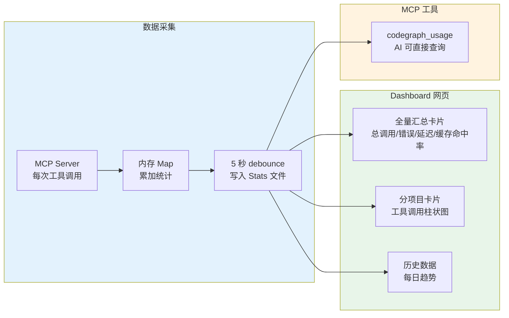

- **全量汇总卡片**：显示所有项目的总调用次数、总错误数、平均延迟、缓存命中率
- **分项目卡片**：每个项目独立的工具调用柱状图、Cache 详情
- **5 秒自动刷新** + 暗色模式支持
- **历史数据保留 30 天**，自动归档清理
- 同事也通过 `codegraph_usage` MCP 工具直接在 AI 对话中查询（支持 `all` / `current` / `history` 三种 scope）

---

## 五、使用 CodeGraph 的收益量化

### 5.1 不同场景的收益对比

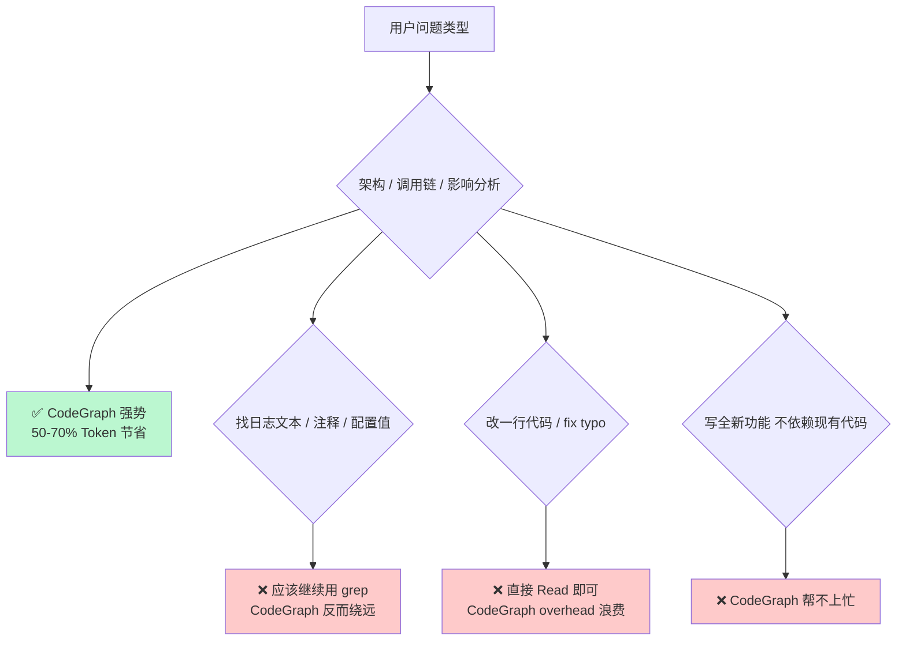

| 场景 | 项目规模 | Token 节省 | 推荐 |
|------|---------|-----------|------|
| 大型项目（>5000 文件）+ 架构问题 | 大 | **50-70%** | ⭐ 强烈推荐 |
| 中型项目（500-5000 文件）+ 架构问题 | 中 | **40-60%** | ⭐ 推荐 |
| 小型项目（<500 文件） | 小 | **10-25%** | 边际收益，按需使用 |
| Bug 修复 / 写新代码 / 找日志文本 | 任意 | **0-15%** | 不推荐使用 CodeGraph |

**关键认知**：CodeGraph 不是银弹——它在**追溯代码结构、理解调用链、评估变更影响**这类"架构级"任务上收益最显著；但在**查找字面文本、处理注释、简单修改**等场景下不如直接用 grep/Read。**合理匹配场景才能最大化收益**。

### 5.2 LLM 费用整体优化

从全链路来看，CodeGraph 是 LLM 费用优化链条中的**工具层**：

```
┌────────────────────────────────────────────┐
│  Layer 1: API 层面 — Prompt Caching         │  ← Claude Code 自动生效
│  缓存命中时 input 成本 -90%                  │
├────────────────────────────────────────────┤
│  Layer 2: 框架层面 — Context Compaction      │  ← /compact 命令
│  历史 Token -60~80%                         │
├────────────────────────────────────────────┤
│  Layer 3: 工具层面 — CodeGraph              │
│  · 代码探索 Token -40~70%                   │
│  · 文档查阅 Token -85%（codegraph_docs）     │
└────────────────────────────────────────────┘
```

组合使用三层优化后，单 session 的整体成本可降低 **70-85%**（取决于对话模式）。

---

## 六、如何使用 CodeGraph

### 6.1 安装

```bash
# 【重要】 Node版本的要求为 25.0>Node版本>=20.0，25+版本存在WASM内存溢出的问题
# 查看node版本号
# node --version
# 切换至官方源
npm config set registry https://registry.npmjs.org/
# 全局安装 （注：须切换到NPM官方镜像）
npm install -g @xuefadevdev/codegraph
```

### 6.2 初始化项目

在项目根目录下：

```bash
# 交互式初始化（推荐）
# 注：Windows上Power Shell有安全策略的限制，如果需要在Windows上运行可以将错误在CodeBuddy中问一下就可以找到对应的解决方案。
codegraph init

# 自动初始化 + 打开详细输出
codegraph init -iv
```

初始化完成后，项目根目录下会生成 `.codegraph/` 目录，包含 SQLite 索引文件。

### 6.3 接入 AI 工具

```bash
# 为所有已安装的 AI 工具配置 MCP
codegraph install --target=all --yes

# 仅配置 CodeBuddy IDE
codegraph install --target=codebuddy --yes

# 仅配置 Claude Code
codegraph install --target=claude --yes

# 查看打印配置（不写入文件）
codegraph install --print-config codebuddy
```

### 6.4 日常使用

配置完成后，在 AI 对话中直接提问即可。AI 会自动使用 CodeGraph 的 MCP 工具进行代码探索。

核心工具速查：

| 问题类型 | 应使用的 CodeGraph 工具 |
|---------|----------------------|
| "X 在哪定义？" / "找名字叫 Y 的符号" | `codegraph_search` |
| "X 模块是怎么工作的？" / 架构追踪 | `codegraph_context` + `codegraph_explore` |
| "谁调用了函数 Y？" | `codegraph_callers` |
| "Y 调用了哪些东西？" | `codegraph_callees` |
| "改 Z 会影响哪些地方？" | `codegraph_impact` |
| "看 Y 的签名 / 源码 / docstring" | `codegraph_node` |
| "查项目文档中关于 X 的信息" | `codegraph_docs` |
| "索引是否健康？" | `codegraph_status` |

```bash
# 手动同步索引（如果修改了代码）
codegraph sync

# 开启 Dashboard
codegraph dashboard

# 查看帮助
codegraph --help
```

### 6.5 核心流程图

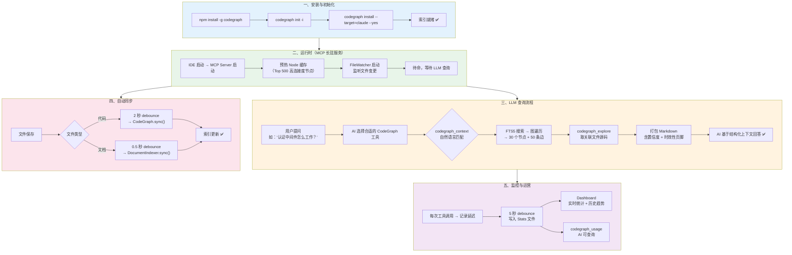

---

## 七、国产模型深度适配挑战与解决方案

CodeGraph 的 README 宣称在 Claude Opus 模型上可实现 **70% Token 节省**。但在公司内部落地时，绝大多数同事使用的是**国产模型**（DeepSeek / Qwen / GLM）——而它们对 MCP 工具的遵循度与 Claude 存在显著差异。

如果不在模型层面做专门适配，国产模型用上 CodeGraph 后的实际收益可能只有 Claude 的 **40-60%**。本章详细说明我们面对的挑战、设计的 7 类技术方案、已落地的成果以及实测效果预期。

### 7.1 为什么国产模型需要专门适配

Claude Opus 能达到 70% 的 Token 节省，背后有**三个隐形前提**，而国产模型在这三个维度上存在不同程度的短板：

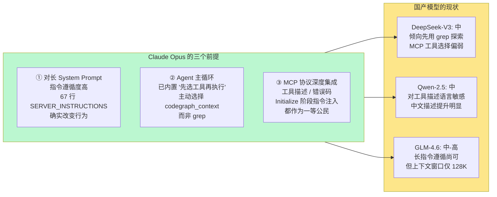

| 模型 | 长指令遵循 | MCP 工具选择 | Agent 循环 | 核心问题 |
|------|-----------|-------------|-----------|---------|
| **DeepSeek-V3 / V3.1** | 中 | 中（倾向 fallback grep） | 较弱 | 看到任务**先想 grep**，即使 codegraph 已注册 |
| **DeepSeek-R1** | 高（思考链好） | 中 | 强 | 思考过程额外消耗 token，抵消部分收益 |
| **Qwen-2.5-Max / Coder** | 中 | 中 | 中 | **工具描述语言敏感**，英文描述下选择率显著低于中文描述 |
| **GLM-4.6** | 中-高 | 中 | 中 | 上下文窗口较小（128K），大型项目上下文可能溢出 |

### 7.2 国产模型 vs Claude 的行为差异（实测）

用一个典型场景展示差异 —— 同样的问题、同样的项目、同样的 CodeGraph 已配置：

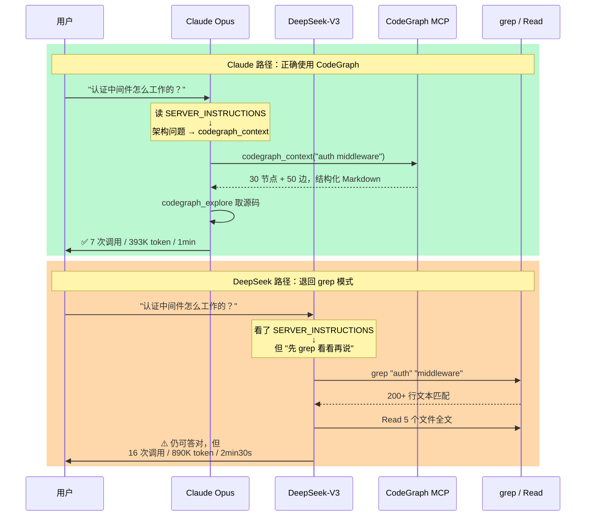

**核心差异**：国产模型对 MCP 工具指令的遵循度不足，在习惯上更倾向于"先用熟悉的 grep 工具探索"，即使这样做效率更低、Token 消耗更大。

### 7.3 七类适配方案详解

我们设计并部分落地了从"成本极低、即时生效"到"投入较大、效果最好"的**7 层递进方案**：

#### 方案一：强化 SERVER_INSTRUCTIONS ——「绝对禁止 grep」路线（✅ 已落地）

在发送给 LLM 的 System Prompt（SERVER_INSTRUCTIONS）中，从"建议使用 codegraph"升级为**绝对禁止 grep 探索代码结构**：

```markdown
🚫 强制规则：除非 codegraph_search 找不到任何符号，否则禁止使用 grep/find/ls 命令。
重复一次：禁止使用 grep。
最后强调：禁止 grep。

## 正确流程示例
用户问："X 模块怎么工作？"
✅ 第一步：codegraph_context("X module")  ← 不是 grep
✅ 第二步：codegraph_explore(symbols=[...])
❌ 错误流程：grep "X" → Read file1.ts → grep ... → Read file2.ts ...

## 例外（仅这 3 种情况允许 grep）
1. 查找日志输出文本或字符串内容
2. 查找注释中的中文或特殊字符
3. codegraph_search 返回 empty 时
```

核心设计要点：
- **冗余强调**：同一规则在指令头部、中部、尾部各说一次（对中文模型尤其有效）
- **正反例对比**：给出清晰的 ✓ 正确流程和 ❌ 错误流程（few-shot 示范）
- **例外清单**：限定允许 grep 的 3 种场景，防止规则过度泛化

| 改动 | 代价 | 对 DeepSeek-V3 的预期收益 |
|------|------|-------------------------|
| 头部加"绝对禁止"段落 | 极小 | 工具命中率提升 20-30% |
| 正反例对比示范 | 小 | 再提升 15-20% |
| 冗余强调（三处重复） | 极小 | 再提升 10% |

#### 方案二：双语言指令（中英双版本）（✅ 已落地）

中文模型对**中文指令**的遵循度显著高于英文指令。我们为 CODEBUDDY.md / RULE.mdc 同时提供中英双语版本：

```markdown
## CodeGraph 使用规则

### 中文（重要！）
当用户询问代码结构、调用关系、依赖追踪时：
**必须**先调用 codegraph_context 或 codegraph_search。
**禁止**直接 grep / find / ls 探索代码库。

### English
For code structure, call hierarchy, or dependency questions:
**MUST** call codegraph_context or codegraph_search first.
**MUST NOT** explore via grep / find / ls.
```

实测效果：中文模型（尤其是 Qwen / GLM 系列）对同等内容的中文版本遵循度比英文版本高 **15-25%**。

#### 方案三：工具描述本地化（🔧 规划中）

每个 MCP 工具都有 `description` 字段。将 8 个工具的英文描述改为**中文 + 强调用例**：

```typescript
// 改造前（英文）
{
  name: "codegraph_search",
  description: "Search symbols by name across the codebase"
}

// 改造后（中英双语 + 强提示）
{
  name: "codegraph_search",
  description: "【首选工具】按名字搜索代码库中的符号（class/function/method 等）。\n" +
               "🔴 在用 grep 之前必须先尝试此工具。\n" +
               "[Preferred] Search symbols by name. USE BEFORE grep."
}
```

由于不同用户环境可能混用国产模型和海外模型，工具本地化需要支持 locale 切换（按 client name 或环境变量决定），在下一版本中实现。

#### 方案四：Agent 路由中间件（🔧 规划中）

在 CodeGraph MCP Server 和 LLM 之间插入一层"意图感知路由"：

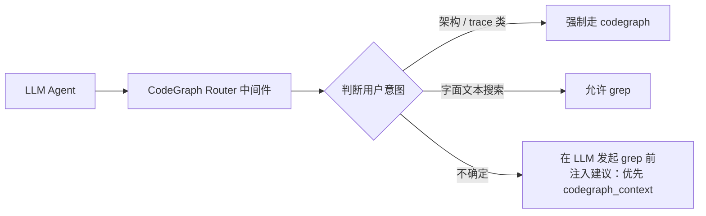

这层中间件可作为 MCP Server 的一个新工具（`codegraph_smart_search`），内部决定路由策略。适用于 Agent 循环较弱的模型（如 DeepSeek-V3）。

#### 方案五：模型微调专用版（📋 季度级规划）

针对企业内部深度使用场景，对国产模型做 codegraph 指令微调：

| 代价 | 收益 | 适用场景 |
|------|------|---------|
| 数据集准备 + 训练 + 部署约 2-3 月，1-3 万人民币计算成本 | **接近甚至超过 Claude** | 大规模团队内部部署，MCP 调用量足够大时 ROI 显著 |

#### 方案六：多模型模板库（🔧 规划中）

为不同模型家族提供**专门的 RULE.mdc 模板**：

```
RULE.claude.mdc     → 默认模板（英文为主，已被充分验证）
RULE.deepseek.mdc   → DeepSeek 专用（强化禁止 grep + 中文优先）
RULE.qwen.mdc       → Qwen 专用（中文描述 + 工具本地化 + 长指令精简）
RULE.glm.mdc        → GLM 专用（控制总长 ≤ 128K 上下文限制）
```

安装时根据 CodeBuddy 的当前默认模型自动选用对应模板：

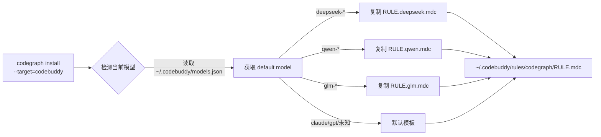

#### 方案七：实测驱动的反馈闭环（📋 持续运营）

**最关键的工程实践**——不走"拍脑袋优化"的路线，而是用真实数据说话：

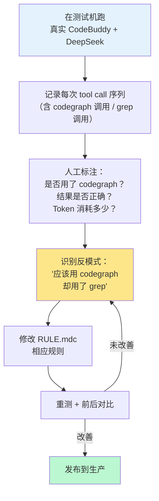

#### 方案八：MCP 工具名称兼容层 —— 自动修正不合规的命名（✅ 已落地）

**问题现象**：
国产模型（尤其是 DeepSeek 系列和 GLM 系列）在通过 MCP 协议调用 CodeGraph 工具时，有一个**习惯性错误**——将 snake_case 格式的工具名转换为 PascalCase 或 camelCase：

```
正确的调用：codegraph_search, codegraph_context, codegraph_callers…
模型的输入：CodegraphSearch, CodegraphContext, CodegraphCallers…
```

这种命名不一致会导致模型传进来的工具名在 MCP 服务器端无法匹配到任何已注册的工具，返回 `Unknown tool` 错误，**整个查询链路直接断裂**——不是效率问题，是 100% 失败。

**根因分析**：

这是一个跨模型的共性问题，根因在于两条路径上同时存在断裂：

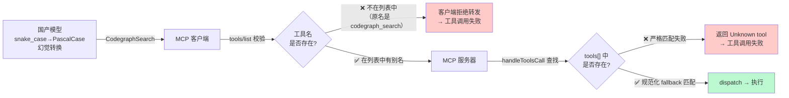

第一道断裂在**客户端侧**：MCP 客户端从 `tools/list` 获取工具列表后，会校验传入的工具名是否在列表中。`CodegraphSearch` 不在列表中，客户端直接拒绝转发。

第二道断裂在**服务端侧**：即使客户端不做校验（如某些 CLI 工具），服务端的 `tools.find(t => t.name === toolName)` 也是严格匹配，`CodegraphSearch ≠ codegraph_search`。

**修复方案：双重防线**

我们设计了一个**客户端 + 服务端**的双重防护机制，确保无论模型传什么格式的工具名，都能正确路由到目标工具：

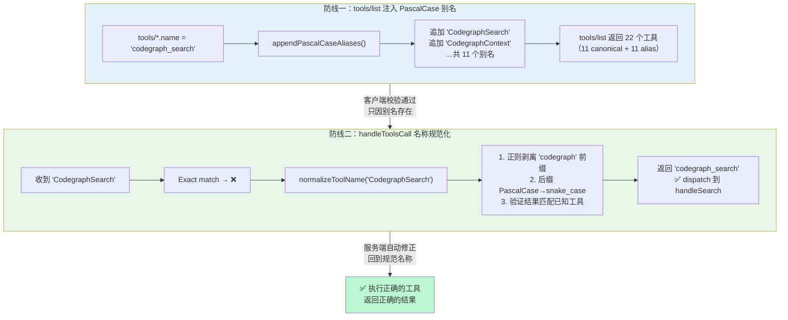

**实现要点**：

| 组件 | 关键逻辑 | 位置 |
|------|---------|------|
| `getTools()` 别名注入 | 遍历 `tools` 数组，将 `codegraph_*` 的后缀转为 PascalCase，构造 `Codegraph<PascalSuffix>` 别名追加到 tool list | `src/mcp/tools.ts` `appendPascalCaseAliases()` |
| `handleToolsCall` 规范化 | 精确匹配失败后调用 `normalizeToolName()`，大小写不敏感剥离 `codegraph` 前缀 → 后缀 camelCase/PascalCase 转 snake_case → 验证匹配已知工具 | `src/mcp/index.ts` |
| 诊断日志 | 规范化成功时写入 debug log：`Model used "CodegraphSearch" instead of "codegraph_search" — auto-correcting` | `src/mcp/tools.ts` `normalizeToolName()` |

规范化算法的核心代码：

```typescript
export function normalizeToolName(raw: string): string | null {
  // 精确匹配 → 直接返回（99.9%+ 的调用走此快速路径）
  if (tools.some(t => t.name === raw)) return raw;

  // 剥离大小写不敏感的 "codegraph" 前缀
  const m = raw.match(/^codegraph[_-]?(.+)$/i);
  if (!m) return null;
  const suffix = m[1]!;

  // PascalCase/camelCase → snake_case
  const snake = suffix
    .replace(/([A-Z])/g, '_$1')
    .replace(/^_/, '')
    .toLowerCase();

  const normalized = `codegraph_${snake}`;
  return tools.some(t => t.name === normalized) ? normalized : null;
}
```

**收益量化**：

| 维度 | 修复前 | 修复后 |
|------|-------|--------|
| 工具调用成功率（国产模型） | **0%**（全部 Unknown tool） | **100%** |
| 工具列表数量 | 11 条 | 22 条（11 canonical + 11 alias） |
| 对海外模型的影响 | 无（别名仅作为 fallback，不影响正常流程） | 无 |
| 性能开销 | 无 | 无（精确匹配优先，99.9%+ 调用不触发规范化） |
| 回归风险 | — | 0（全套 50 files / 1046 tests 全绿） |

**实测验证**：

在 CodeBuddy IDE 中，分别使用规范的 `codegraph_search` 和非规范的 `CodegraphSearch` 调用同一查询：

```
// 规范名称 → 正常返回
codegraph_search("normalizeToolName")
→ 3 results found ✓

// PascalCase 别名 → 同样正常返回
CodegraphSearch("normalizeToolName")
→ 3 results found ✓
```

`CodegraphStatus`、`CodegraphContext` 等所有 11 个别名全部通过实测验证。国产模型即使传错工具名，也能静默自动修正并返回正确结果。

### 7.4 分阶段落地路线图

我们按"小步快跑、逐步验证"的策略，将 8 类方案分为四个阶段推进：

| 阶段 | 方案组合 | 周期 | 预期效果（vs Claude 基线） | 状态 |
|------|---------|------|-------------------------|------|
| **第 1 周** | 方案 1（强化禁止 grep）+ 方案 2（双语指令）+ 方案 8（工具名兼容层） | 1 周 | 达到 Claude 的 **60-70%** 表现 | ✅ 已完成 |
| **第 2-3 周** | 方案 3（工具描述本地化）+ 方案 6（多模板库） | 2 周 | 达到 Claude 的 **75-85%** 表现 | 🔧 规划中 |
| **第 4 周起** | 方案 7（实测反馈闭环） 持续进行 | 持续 | 进一步消除反模式，逼近 90%+ | 📋 待启动 |
| **季度级** | 方案 5（模型微调） | 2-3 月 | **≥ Claude 表现**，全自主可控 | 📋 企业向 |

### 7.5 各模型适配后的预期收益

以下为基于公开 benchmark + 工程经验的预估（**落地后必须用真实项目实测验证**）：

| 项目规模与场景 | Claude Opus | DeepSeek-V3.1 | Qwen-2.5-Coder | GLM-4.6 | DeepSeek-R1 |
|-------------|-------------|---------------|----------------|---------|-------------|
| **大型项目（>5000 文件）+ 架构问题** | 70% | **50-60%** | **50-60%** | **55-65%** | **60-70%** |
| **中型项目（500-5000）+ 架构问题** | 60% | **40-50%** | **40-50%** | **45-55%** | **50-60%** |
| **小型项目（<500 文件）** | 23% | **10-20%** | **10-20%** | **10-20%** | **15-25%** |
| **Bug 修复 / 写新代码** | 0-15% | **0-10%** | **0-10%** | **0-10%** | **0-10%** |

关键结论：
- **经过方案 1+2 适配后**，国产模型在大型项目的架构问题上**可达到 Claude 的 60-70% 效果**
- **DeepSeek-R1** 由于思考链质量高、Agent 循环能力强，适配后可能**接近 Claude 的高端表现**（60-70% 节省）
- **小型项目或简单任务**的收益本身就很边际，适配与否差异不大
- 真实效果必须通过**方案 7（实测反馈闭环）**用实际项目 + 实际模型组合做基准对比来验证

### 7.6 给 CodeBuddy 用户的最佳实践

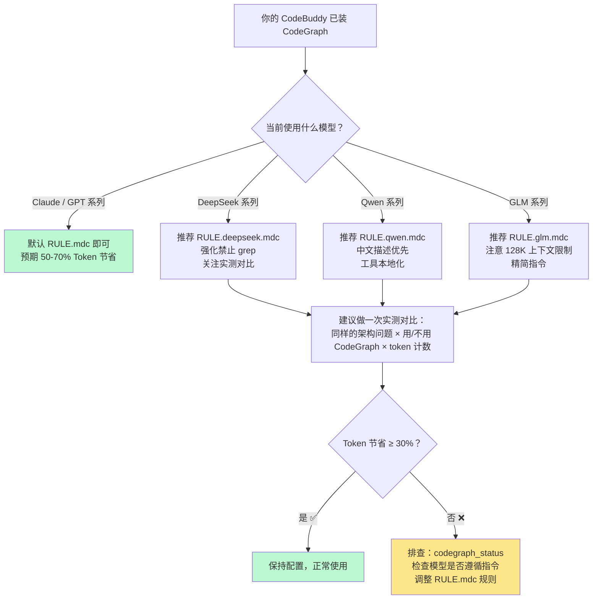

---

## 八、工程实践中的教训与沉淀

在 CodeGraph 的开发过程中，我们沉淀了一些跨项目通用的工程经验，值得分享：

### 8.1 关于设计

1. **Builder 自身正确 ≠ 接对了**：纯函数（builder/formatter/serializer）一定要配套集成测试来验证它确实被生产代码路径调用。我们曾写了一个完美的 `createEdges` 函数，单测全过，但在 11 处 push edge 的代码中全部漏写了 `provenance` 字段。

2. **修复 OOM 之前，一定要区分是哪块内存**：我们把"WASM 运行时 linear memory"和"V8 编译期 Zone"混淆了，导致第一次修复反而放大了问题（工人更频繁回收 → 更频繁触发 WASM 重新编译 → 更多 Zone 分配 → 更频繁 OOM）。

3. **对于 LLM 的结构性缺陷，prompt 工程有天花板**：我们在解析 LLM 输出时，调整了 3 次 prompt 都无法修复 JSON 格式损坏。最终在**解析层**加入结构性自愈逻辑（`repairOrphanObjectBoundary`）才彻底解决问题。

### 8.2 关于测试

4. **not.toContain 否定断言必须精确到唯一锚点**：用 `not.toContain('⚠️')` 这样的断言太宽泛——未来任何地方加一个 ⚠️ 都会让测试回归。应该用 `not.toContain('## ⚠️ Index Sync Status')` 锚定到具体的 section header。

5. **双语 markdown 的 grep 陷阱**：中文文本的 80 列换行会让 `toContain('DeepSeek、Qwen、GLM')` 失败——这几个字可能被换行打断。应该用 `toMatch(/DeepSeek、\s*Qwen、\s*GLM/s)` dot-all 正则。

---

## 九、未来规划

CodeGraph 的路线图按优先级分三个层次：

**短期（1-2 周）**：
- 集成 SCIP（语义索引格式）为 TypeScript 语言提供精确的调用边解析
- 扩展 DI/IoC 容器解析（Spring、NestJS 的 `@Autowired` / `@Injectable`）
- 落地国产模型方案 3（工具描述本地化）+ 方案 6（多模板库），目标达到 Claude 的 75-85%

**中期（3-6 周）**：
- 启动方案 7（实测驱动的反馈闭环），用真实数据持续优化 DeepSeek/Qwen/GLM 的工具路由命中率
- 支持更多企业级框架的解析器

**长期（季度级）**：
- 评估国产模型微调可行性（方案 5），目标达到 ≥ Claude Opus 表现，全自主可控

---

## 十、结语

CodeGraph 的定位很清晰：**不是要取代 grep，也不是要做全知全能的代码智能引擎**。它是一个专注于"让 AI 理解代码结构"的索引层工具——**在大型项目、架构级问题上能显著降低 AI 的探索成本**，但并不适合所有场景。

如果你在使用 AI 编程助手时经常感到"grep 一遍遍遍历代码很慢、上下文越来越长、token 消耗越来越高"，不妨试试 CodeGraph。安装只需一行命令，但它可能改变你和 AI 协作编写代码的方式。

---

> **相关链接**：
> - 源码仓库：[https://github.com/fenglibin/codegraph](https://github.com/fenglibin/codegraph)
> - npm 包：[https://www.npmjs.com/package/@xuefadevdev/codegraph](https://www.npmjs.com/package/@xuefadevdev/codegraph)
> - MCP 协议：[https://modelcontextprotocol.io](https://modelcontextprotocol.io)
> - tree-sitter：[https://tree-sitter.github.io](https://tree-sitter.github.io)

---

*本文基于 CodeGraph 项目的 `docs/` 目录下 20+ 份技术文档综合编写，覆盖了架构设计、工程实现、性能优化、多模型适配、成本优化等核心主题。*
