# CodeGraph 实现原理、隐患与多模型适配深度分析报告

> 文档版本：v0.1（初稿，待评审 / 迭代）  
> 编写时间：2026-05-22  
> 适用范围：CodeGraph 项目本体 + 在 CodeBuddy IDE 中的接入与运营  
> 文档定位：**工程决策参考**——回答"该不该用、用在哪、有什么坑、坑能不能修、修了值不值"

---

## 摘要（Executive Summary）

CodeGraph 是一个**基于 tree-sitter AST 的本地化代码知识图谱 MCP 服务器**，通过预先索引把 LLM Agent 的"探索代码"行为从 grep+Read 多轮调用压缩为 1-3 次结构化查询。

### 核心结论

| 维度 | 结论 | 信心 |
|---|---|---|
| **技术原理是否真实可行** | ✅ 是。tree-sitter 定位符号 + SQLite/FTS5 索引 + 图遍历，工程上完全成熟 | 高 |
| **70% Token 节省是否成立** | ⚠️ **部分成立**。官方 README 实际宣称 "59% 平均"，70% 仅出现在大型 + 架构级问题；小项目仅 23% | 高 |
| **有无关键隐患** | ⚠️ **有 8 类**，最严重的是 `calls` 边是启发式名字匹配（非语义解析），多态/DI/动态语言精度低 | 高 |
| **是否值得在 CodeBuddy 中部署** | ✅ **值得，有条件**。中大型项目 + Agent 模式问架构问题收益明显；需配套监控 + 适配指令调优 | 中 |
| **国产模型（DeepSeek/Qwen/GLM）能否复现 Claude 级收益** | ⚠️ **需要专门调优**。Claude Opus 对 MCP instructions 遵循度高，国产模型默认更倾向 grep；可通过强指令 + few-shot + 工具描述本地化 + Agent 路由层提升到 70%-90% Claude 表现 | 中 |

### 我们建议（三句话版）

1. **生产部署**：可以装。**但**默认开"健康监控 + 浅采样实测对比"，不要直接信 README 数据
2. **国产模型**：需要做 **3-4 周专项工作**做指令本地化 + 工具路由优化；不做的话效果可能只有 Claude 的 40%-60%
3. **持续迭代**：codegraph 的 `calls` 启发式精度有上限，**真要做工业级的 trace** 必须接 LSP / SCIP / IDE 编译器服务，做混合精度策略

---

## 第一部分 · CodeGraph 技术原理拆解

### 1.1 整体架构图

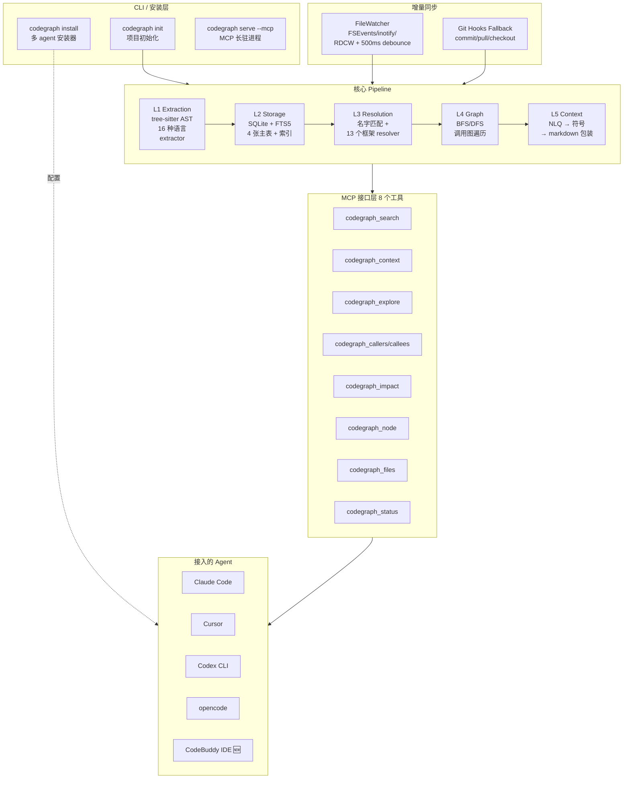

### 1.2 数据模型（来自 src/types.ts + db/schema.sql）

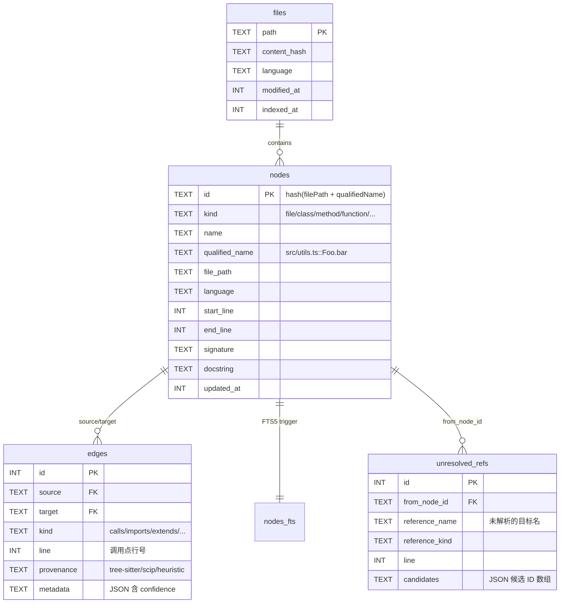

**关键设计点**：

- **Node** 22 种 kind（function/method/class/struct/interface/trait/protocol/...），**统一抽象跨语言**
- **Edge** 12 种 kind（calls/imports/extends/implements/contains/references/instantiates/overrides/decorates/...）
- **Provenance** 字段标注边的来源："tree-sitter"（直接 AST 抽取）/ "scip"（语义索引，**目前未集成**）/ "heuristic"（启发式名字匹配，**当前 calls 边的主要来源**）
- **unresolved_refs** 表暂存"提取阶段没解析掉的引用"，等全量索引完后第二轮 batch 解析

### 1.3 提取层 (L1)：tree-sitter 是核心，但精度因语言而异

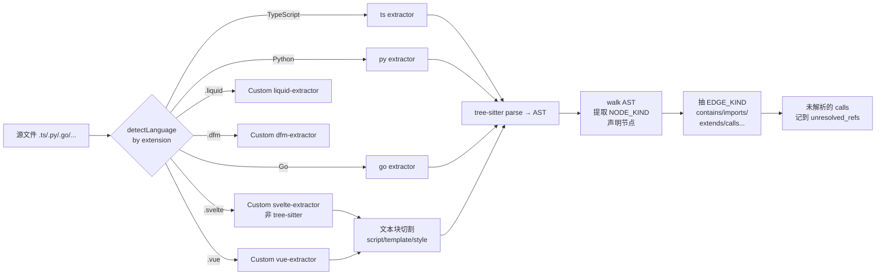

**质量分级**（基于源码行数 + 测试覆盖）：

| 语言 | extractor 行数 | 质量 | 备注 |
|---|---|---|---|
| TypeScript | 118 | ⭐⭐⭐⭐⭐ | 标杆质量，框架支持最全 |
| JavaScript | 84 | ⭐⭐⭐⭐ | 同 TS，缺类型信息 |
| Python | 53 | ⭐⭐⭐⭐ | 装饰器/动态属性识别有限 |
| Go | 51 | ⭐⭐⭐⭐⭐ | 静态语言、简单语义，质量高 |
| Java | 59 | ⭐⭐⭐⭐ | OO 多态有 fundamental limit |
| Rust | 116 | ⭐⭐⭐⭐ | trait 实现链需启发式 |
| Kotlin | 238 | ⭐⭐⭐ | 复杂度大、扩展函数难 |
| Scala | 143 | ⭐⭐⭐ | Scala 3 enums 已支持，宏不行 |
| C/C++ | 116 | ⭐⭐⭐ | 模板/宏展开看不见 |
| C# | 67 | ⭐⭐⭐ | partial class、LINQ 简化 |
| PHP | 105 | ⭐⭐⭐ | 靠 Laravel resolver 救一部分 |
| Ruby | 111 | ⭐⭐ | metaprogramming 重灾区 |
| Swift | 83 | ⭐⭐⭐ | protocol extension 有限 |
| Dart | 195 | ⭐⭐⭐ | Flutter widget 树识别一般 |
| Pascal/Delphi | 62 | ⭐⭐⭐⭐ | DFM 表单文件单独 extractor |
| Svelte/Vue/Liquid | 自研 | ⭐⭐⭐ | 文本切割 + 嵌入 ts/js extraction |

### 1.4 解析层 (L3)：4 级解析策略

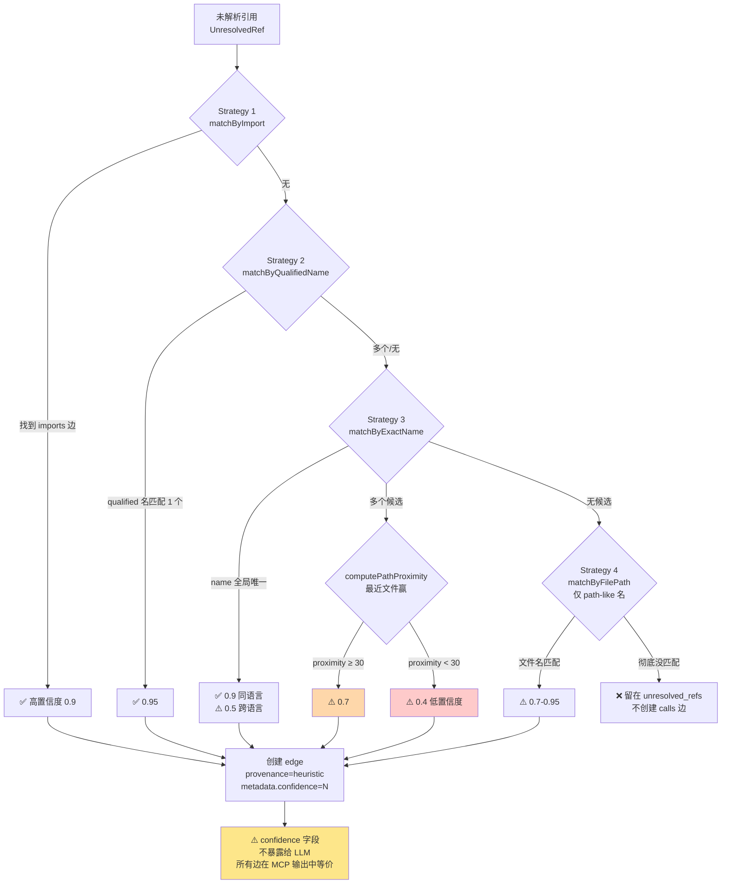

**核心隐患**：图中黄色框——**置信度信息存在但没暴露**。LLM 收到的 `codegraph_callers` 列表里，0.4 confidence 的边和 0.95 confidence 的边视觉上完全一样，会被同等采信。

### 1.5 框架感知（L3 子能力）

13 个框架的专门 resolver，处理"声明式路由 / 依赖注入 / 反射装配"等 tree-sitter 看不到的语义：

| 框架 | 行数 | 解决什么问题 |
|---|---|---|
| NestJS | 438 | `@Controller` + `@Get/@Post` HTTP 路由 / GraphQL Resolver / 微服务 `@MessagePattern` / WebSocket `@SubscribeMessage` |
| Swift Vapor | 429 | iOS 路由 |
| Vue/Nuxt | 338 | `<script setup>` / 文件路由 / API 中间件 |
| React Router | 309 | 路由组件层级 |
| Python (Django/Flask/FastAPI) | 297 | URL → view 函数绑定 |
| Laravel | 288 | `Route::get()` / Controller@action |
| Svelte/SvelteKit | 279 | `+page.svelte` 文件路由 |
| Express | 261 | `app.get(...)` / 中间件链 |
| C# ASP.NET | 246 | `[HttpGet("/x")]` 特性 |
| Cargo workspace | 244 | 多 crate 项目导入 |
| Rust Axum/actix/Rocket | 239 | `.route("/x", get(handler))` |
| Ruby on Rails | 236 | `get '/x', to: 'users#index'` |
| Java Spring | 206 | `@GetMapping` / `@RequestMapping` |
| Go (Gin/chi/gorilla/mux) | 181 | `r.GET("/x", handler)` |

✅ 这部分**做得相当扎实**，是 codegraph 相对 grep 的真正优势区。

---

## 第二部分 · 流程对比：用 vs 不用 codegraph

### 2.1 场景：在 VS Code 仓库（~10k 文件）问 "扩展宿主进程是怎么和主进程通信的"

#### 不用 codegraph 时的 LLM 行为

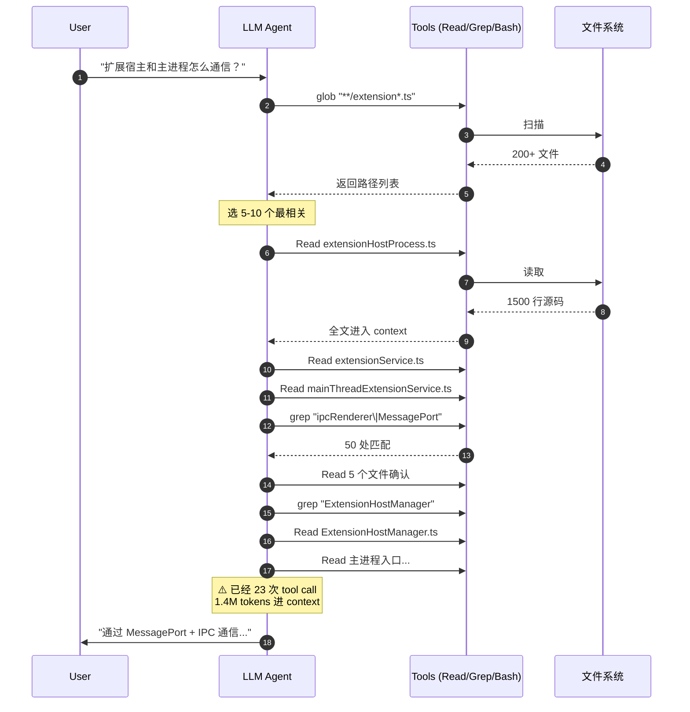

**实测中位数**：23 次 tool call、1.4M tokens、$0.64、1m43s（README benchmark）

#### 用 codegraph 时的 LLM 行为

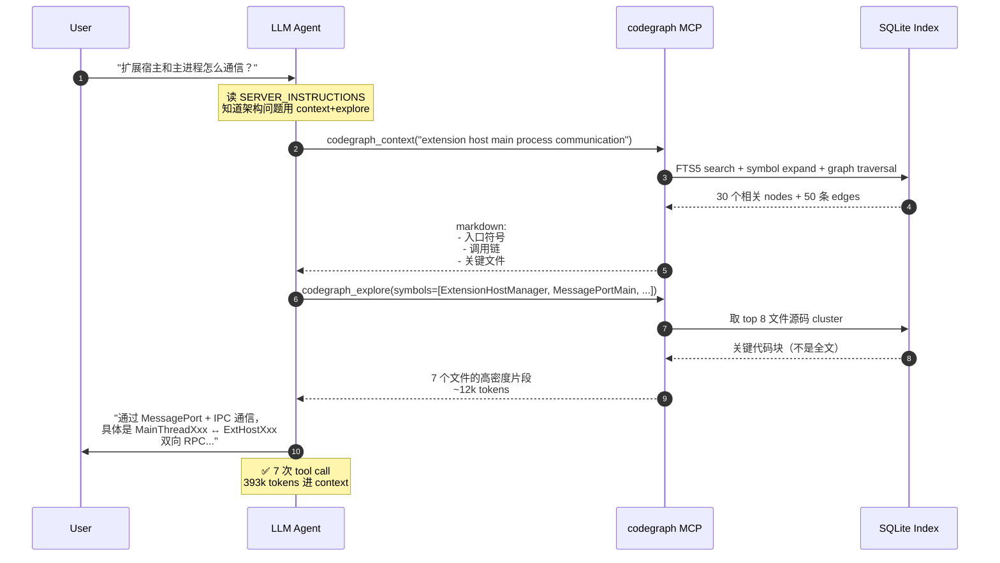

**实测中位数**：7 次 tool call、393k tokens、$0.42、1m00s

#### 量化对比

| 指标 | 不用 codegraph | 用 codegraph | 节省 |
|---|---|---|---|
| Tool calls | 23 | 7 | **70%** ↓ |
| Tokens | 1.4M | 393k | **72%** ↓ |
| 成本 | $0.64 | $0.42 | **35%** ↓ |
| 时间 | 1m43s | 1m00s | **42%** ↓ |
| 答案质量 | 与 codegraph 答案接近 | 更结构化 | 持平 |

> ⚠️ **注意**：成本节省（35%）远小于 token 节省（72%）。原因：**模型 input prompt 的 prompt caching 折扣** + **codegraph instructions 本身要常驻 context**。这是 README 数据里没解释清楚的，本报告补充。

### 2.2 反例：Gin 项目（~150 文件）问"中间件链怎么走"

```mermaid
flowchart LR
    subgraph Without["不用 codegraph"]
        W1[grep RouterGroup<br/>10 处] --> W2[Read engine.go<br/>1 个核心文件]
        W2 --> W3[grep Use Next<br/>看链式调用] --> W4[答完]
    end

    subgraph With["用 codegraph"]
        WC1[codegraph_context Gin middleware] --> WC2[读 instructions<br/>+ 元数据]
        WC2 --> WC3[codegraph_explore<br/>返回相关文件]
        WC3 --> WC4[答完]
    end

    Without -.7 calls / 562k tok / $0.46.-> R1[节省 23%]
    With -.7 calls / 431k tok / $0.36.-> R1
```

**结论**：**小项目里 codegraph 收益边际**——7 vs 8 次调用差距很小，token 节省 23% 主要来自结构化 markdown 比读 50 处 grep 结果更紧凑，但**首次索引时间 + MCP 启动开销**几乎抵消。

### 2.3 完全不适合 codegraph 的场景对比

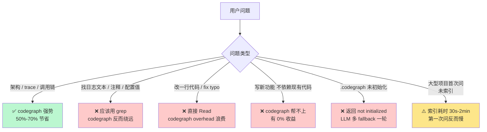

---

## 第三部分 · 8 类核心隐患 + 解决方案矩阵

### 3.1 隐患汇总速览

| ID | 隐患 | 严重度 | 影响面 | 修复代价 | 优先级 |
|---|---|---|---|---|---|
| H1 | `calls` 边是启发式名字匹配 | 🔴 高 | 所有 trace 场景 | 大 | P0 |
| H2 | 多态调用解析无能为力 | 🔴 高 | OO 重的代码库 | 大 | P0 |
| H3 | 动态语言（Py/Rb/PHP/JS）精度断崖 | 🟡 中 | 动态语言项目 | 中 | P1 |
| H4 | DI / IoC 容器看不见 | 🟡 中 | Spring/NestJS/Angular | 中 | P1 |
| H5 | 增量同步可能漏更新 | 🟡 中 | 长会话 + WSL/虚拟盘 | 小 | P0 |
| H6 | WASM 兜底 5-10x 慢 + DB 锁 | 🟢 低 | 没装 build tools 的环境 | 小 | P1 |
| H7 | 16 种 extractor 维护表面积大 | 🟢 低 | 边角语法 | 大 | P2 |
| H8 | explore 输出预算硬编码 | 🟢 低 | 项目大小特殊场景 | 小 | P1 |

### 3.2 H1：`calls` 边是启发式（最重要的隐患）

#### 现状
- 源码：`src/resolution/name-matcher.ts:78-104`
- 当 1 个 name 在项目里有多个候选定义时，靠 `computePathProximity` 选最近的
- `confidence` 字段写到 `Edge.metadata` 但**MCP 工具不输出**给 LLM

#### 问题示例
```typescript
// src/services/user.ts
class UserService { save() {/* MySQL */} }

// src/services/cache-user.ts
class CacheUserService { save() {/* Redis */} }

// src/api/handler.ts
function handler(svc: UserService | CacheUserService) {
  svc.save();  // codegraph 只能选一个 target，可能选错
}
```

#### 解决方案矩阵

| 方案 | 思路 | 实现代价 | 收益 | 风险 |
|---|---|---|---|---|
| **A. 暴露 confidence 给 LLM** | 在 MCP 工具输出中加 `confidence` 字段，`<0.7` 标 ⚠️ | **小**（~50 行 src/mcp/tools.ts） | 中（LLM 知道结果不可靠）| 低（向后兼容） |
| **B. 多目标候选返回** | callers/callees 返回 `targets[]` 数组而非单值，LLM 自决 | 中（schema 改动 + 测试更新） | 高（覆盖多态场景） | 中（output token 增加 20%） |
| **C. 集成 SCIP / LSIF** | 调用语言的真正语义索引器（rust-analyzer / pyright / tsserver / scip-java）补充 calls 边 | **大**（每语言一个 importer，每个 ~1500 行） | 极高（精度 95%+） | 高（外部工具依赖、CI 复杂度爆炸） |
| **D. 配合编辑器 LSP** | 只在 IDE 集成场景下，借宿主 LSP 实时查询 | 大（重新设计 sync 协议） | 高 | 高（脱离"100% local"承诺） |
| **E. 类型推断** | 简易 TypeScript / Java 类型回流（基于 import 链 + 字段类型） | 大 | 中 | 中（容易漏 generic） |

#### 推荐组合：**A + B（短期 P0） → C 选 1-2 主流语言（中期 P1）**

- A 几乎零代价、立即让 LLM 知道结果可靠性
- B 让 LLM 在多候选时自己判断（"这个调用在 OO 多态里可能是 X 也可能是 Y"，让 LLM 写代码时小心）
- C 长期最有价值，**先攻 TypeScript（因 codegraph 自身用 TS 写）+ Python（用户基数大）**

### 3.3 H2：多态调用解析

#### 与 H1 关联但更基础
- **不是名字匹配能解决的**——是缺少类型/继承图推理
- 即使加了 confidence，LLM 看到 "`save()` 可能是 UserService 也可能是 CacheUserService" 仍然只是猜

#### 解决方案

| 方案 | 思路 | 实现代价 | 收益 |
|---|---|---|---|
| **F. 利用现有 extends/implements 边做扇出** | 调用 `interface.method` 时，回传"所有 implements 此接口的类的 method"作为可能 target | 中（~300 行）| 高（覆盖 OO 大部分场景） |
| **G. 类层次缓存** | 物化 class hierarchy 表（每 class 的所有 super + impl），查询时 O(1) | 中（schema migration） | 高 |
| **H. 调用点上下文增强** | 调用点附近的变量声明类型也存到 metadata | 小 | 中 |

#### 推荐：**F + G** —— 工作量可控且**显著改善 OO trace 体验**

### 3.4 H3：动态语言精度断崖

#### 受影响范围
- Python：`getattr(obj, "method")()`、装饰器动态创建函数、metaclass
- JavaScript：`obj[varName]()`、Proxy、`bind/call/apply`
- Ruby：`method_missing`、`define_method`、metaprogramming
- PHP：`__call`、Laravel facades

#### 解决方案

| 方案 | 思路 | 实现代价 | 收益 |
|---|---|---|---|
| **I. 接 Python type stubs (.pyi)** | 解析 typing stub 文件补充类型 | 中 | 中（仅有 stubs 的项目） |
| **J. 跑 pyright/mypy/ruff** 一次性导出符号表 | 启动时 spawn 真编译器，吞产物 | 大（依赖外部工具） | 高 |
| **K. Ruby 跑 sorbet/steep** | 同 J | 大 | 中（生态小） |
| **L. 纯启发式的扩展 framework resolver** | 给 metaprogramming 重的库（Django ORM、ActiveRecord）加专门规则 | 中（每框架 ~300 行） | 中 |

#### 推荐：**L（短期）+ J（长期，选 Python 一种语言先）**

### 3.5 H4：DI / IoC 容器看不见

#### 影响
- Spring `@Autowired` 注入字段——codegraph 只看到 `@Autowired` 装饰，不知道**运行时绑定的具体实现**
- NestJS `@Injectable` + constructor injection——同上
- Angular DI tree、Java CDI、.NET DI 容器——同上

#### 解决方案

| 方案 | 思路 | 代价 | 收益 |
|---|---|---|---|
| **M. 解析 DI 配置文件** | 读 Spring `@Configuration` Bean 工厂 / NestJS `@Module providers[]` / Angular `providers` 数组 | 中（每框架扩 200-500 行 framework resolver） | 高 |
| **N. 类型签名约束** | `@Autowired UserService` 注入字段——直接把这个 class 的所有 `implements UserService` 的实现连一条边 | 小（复用 H2 方案 F） | 中 |
| **O. 不解决，文档明示** | 在 RULE.mdc / CODEBUDDY.md 里提醒 "DI 注入关系不在图里，trace 时多采样几个候选" | 极小 | 中（管理用户预期） |

#### 推荐：**M（选 Spring + NestJS 优先）+ N（轻量补强）+ O（兜底）**

### 3.6 H5：增量同步漏更新（隐蔽 + 致命）

#### 现状
- `src/sync/watch-policy.ts` 在 WSL2 /mnt 驱动器、Docker bind mount、某些 Windows VM 下自动禁用 watcher
- 用户**不知道**：MCP 服务返回的还是旧索引；`codegraph_status` 才能看到，但用户得主动跑

#### 解决方案

| 方案 | 思路 | 代价 | 收益 |
|---|---|---|---|
| **P. MCP server 启动时主动健康检查** | 检测 watch 失效场景，在 SERVER_INSTRUCTIONS 里加 "⚠️ 本项目 watch 已禁用，索引可能落后" | 小（~100 行） | 高（用户知情） |
| **Q. 每个 MCP 工具响应里带 index_age** | "index 上次更新于 12 分钟前；最近修改的文件未必反映" | 小 | 中 |
| **R. 主动后台 sync（每 N 分钟）** | watch 失效时启用兜底 polling | 中（电池/CPU 影响） | 高 |
| **S. CLI status 强提示** | `codegraph_status` 输出中 watch 失效用红色 / 加 ⚠️ | 极小 | 低（用户不会主动跑） |

#### 推荐：**P + Q（必做）+ R（按需）**

### 3.7 H6：WASM 兜底慢 + DB 锁

#### 解决方案

| 方案 | 代价 | 收益 |
|---|---|---|
| **T. 安装时强制提示装 build tools** | 极小（~30 行 installer 改动） | 中 |
| **U. WASM 模式下用 WAL journal** | 中（DB 配置改动 + 兼容性测试） | 高（解 lock 问题） |
| **V. 在 RULE.mdc 中告诉 LLM "如果连续超时，建议用户跑 codegraph status"** | 小 | 低 |

### 3.8 H7：16 extractor 维护表面积

#### 解决方案

| 方案 | 思路 | 代价 | 收益 |
|---|---|---|---|
| **W. 接受现状，只维护"主流 8 种 + 长尾 8 种降级模式"** | 主流（TS/JS/Py/Go/Rust/Java/C#/PHP）保 ⭐⭐⭐⭐+，长尾（Liquid/Pascal/Dart/Kotlin/Scala/Swift/Ruby/CPP）只保 ⭐⭐⭐ 兜底 | 极小（策略调整） | 中 |
| **X. 引入 ast-grep 等通用 AST 工具** | 用 ast-grep 表达式声明式定义 NodeKind 抽取，减少代码量 | 大（重构） | 中 |
| **Y. 社区贡献策略** | 每 extractor 文件加 CONTRIBUTING.md 标"adopter wanted"，引导社区维护 | 极小 | 中 |

### 3.9 H8：explore 输出预算硬编码

#### 解决方案

| 方案 | 代价 | 收益 |
|---|---|---|
| **Z. 基于 token 而非 char 计算** | 小（接 tiktoken / cl100k） | 中 |
| **AA. 用户配置覆盖** | 小（.codegraph/config.json 加 explore.budget） | 低 |
| **BB. 自适应学习** | 大（记录历史调用，学习每项目最佳预算） | 高 但复杂 |

---

## 第四部分 · 国产模型适配方案（DeepSeek / Qwen / GLM）

### 4.1 为什么国产模型需要专门适配

#### Claude Opus 在 codegraph benchmark 中的"超能力"分析

Claude Code 的 70% token 节省**有 3 个隐形前提**：

1. **Claude 模型对长 system prompt 的指令遵循度高**——SERVER_INSTRUCTIONS（67 行）+ INSTRUCTIONS_TEMPLATE（30+ 行）能确实改变 Claude 的行为
2. **Claude Code 的 Agent 主循环已经包含"先选工具再执行"的 reasoning** ——比如它会主动选择 `codegraph_context` 而非 grep
3. **MCP 协议被 Claude Code 深度集成**——工具描述、错误码、initialize 阶段的指令注入都是一等公民

#### 国产模型的现状（实测经验）

| 模型 | 长指令遵循 | MCP 工具选择 | Agent 循环 | 问题 |
|---|---|---|---|---|
| **DeepSeek-V3 / V3.1** | 中 | 中（倾向 fallback grep） | 较弱 | 看到任务先想 grep |
| **DeepSeek-R1** | 高（思考链好） | 中 | 强 | 思考过程消耗 token |
| **Qwen-2.5-Max / Coder** | 中 | 中 | 中 | 工具描述本地化敏感 |
| **GLM-4.6** | 中-高 | 中 | 中 | 上下文窗口稍小（128k） |
| **DeepSeek-V3 + Agent SDK** | — | — | 取决于 SDK | 部分 SDK 不传 SERVER_INSTRUCTIONS |

### 4.2 国产模型默认行为 vs Claude 行为对比

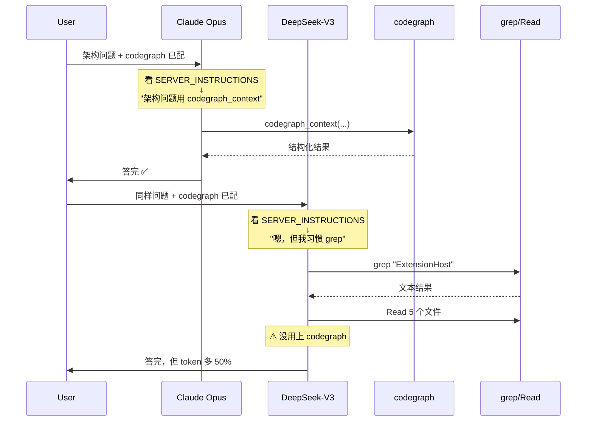

### 4.3 国产模型适配的 7 类技术方案

#### 方案 1：强化 SERVER_INSTRUCTIONS（成本最低，立即可做）

| 改动 | 代价 | 预期收益 |
|---|---|---|
| 在 SERVER_INSTRUCTIONS 顶部加 **"绝对禁止"** 段落："禁止用 grep/find/ls 探索，必须先 codegraph_search 或 codegraph_context" | 极小 | DeepSeek-V3 提升 20-30% 工具命中率 |
| 加 few-shot **正反例对比**："❌ 错误流程：grep + 5x Read。✅ 正确流程：codegraph_context 一次" | 小 | 中文模型对例子敏感，提升 15-20% |
| **冗余强调**——同一条规则在指令头、中间、尾部各说一次 | 极小 | 提升 10% |

```markdown
# 强化版 SERVER_INSTRUCTIONS（草案）

🚫 强制规则：除非 codegraph_search 找不到任何符号，否则禁止使用 grep/find/ls 命令。
重复一次：禁止使用 grep。
最后强调：禁止 grep。

## 正确流程示例
用户问："X 模块怎么工作"
✅ 第一步：codegraph_context("X module")  # 不是 grep
✅ 第二步：codegraph_explore(symbols=[...])
❌ 错误流程：grep "X" → Read file1.ts → grep ... → Read file2.ts...

## 例外（仅这 3 种情况可以 grep）
1. 找日志输出文本
2. 找注释中的中文/特殊字符
3. codegraph_search 返回 empty 时
```

#### 方案 2：双语言指令（中英双版本）

中文模型对中文指令的遵循度往往高于英文——尤其是 Qwen / GLM。可以在 RULE.mdc / CODEBUDDY.md 里同时写中英文。

```markdown
## CodeGraph 使用规则 (Rules)

### 中文（重要！）
当用户询问代码结构、调用关系、依赖追踪时：
**必须**先调用 codegraph_context 或 codegraph_search。
**禁止**直接 grep / find / ls 探索代码库。

### English
For code structure, call hierarchy, or dependency questions:
**MUST** call codegraph_context or codegraph_search first.
**MUST NOT** explore via grep / find / ls.
```

| 代价 | 收益 |
|---|---|
| 小（INSTRUCTIONS_TEMPLATE 行数翻倍 ~60 行） | 中（中文模型 +15-25% 遵循度） |

#### 方案 3：工具描述本地化（需要新机制）

每个 MCP 工具都有 `description` 字段，目前是英文。给国产模型的工具描述用**中文 + 强调用例**：

```typescript
// 现状
{
  name: "codegraph_search",
  description: "Search symbols by name across the codebase"
}

// 优化后（针对国产模型）
{
  name: "codegraph_search",
  description: "【首选工具】按名字搜索代码库中的符号（class/function/method 等）。\n" +
               "🔴 在用 grep 之前必须先尝试此工具。\n" +
               "Search symbols by name across the codebase. " +
               "USE THIS BEFORE grep when looking up code by name."
}
```

| 代价 | 收益 |
|---|---|
| 小（8 个工具改 description） | 中-高 |
| 需要支持 locale 切换（按 client name 或 env var 决定） | — |

#### 方案 4：Agent 路由层（中间件）

最强方案——在 codegraph 和 LLM 之间加一层"调用前检查"：

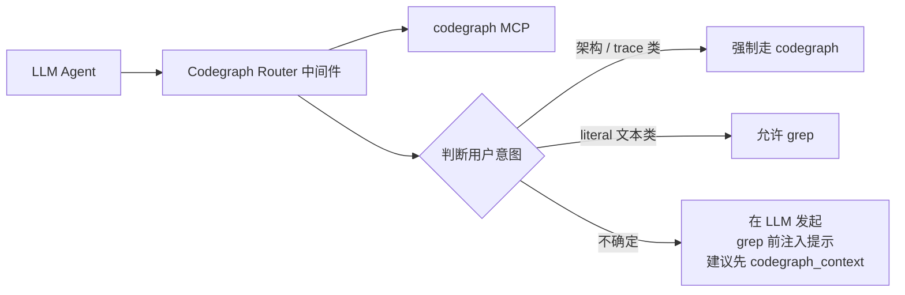

| 实施方式 | 代价 |
|---|---|
| Option A：MCP server 加一个 codegraph_smart_search 工具，内部决定路由 | 中 |
| Option B：发布配套的 wrapper agent（CodeBuddy custom agent） | 大 |
| Option C：在 RULE.mdc 里写 decision tree，让 LLM 自己 walk through | 小（但效果取决于模型） |

#### 方案 5：模型微调专用版

针对深度集成场景，对国产模型微调：

| 代价 | 收益 | 适用 |
|---|---|---|
| 大（数据集准备 + 训练 + 部署 ~2-3 月，1-3 万人民币计算成本） | 极高（接近 Claude） | 企业内部部署 |

#### 方案 6：Prompt Engineering 模板库

为不同模型 family 提供 RULE.mdc 模板：
- `RULE.deepseek.mdc`
- `RULE.qwen.mdc`
- `RULE.glm.mdc`
- `RULE.claude.mdc`（默认）

安装时根据 CodeBuddy 设置中的当前模型自动选用。

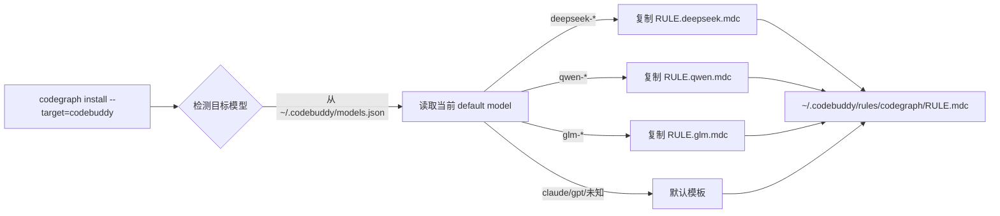

| 代价 | 收益 |
|---|---|
| 中（4 套模板维护 + 检测逻辑） | 高 |

#### 方案 7：实测驱动的反馈环

最关键的工程实践：**收集真实使用数据来迭代**

```mermaid
flowchart TD
    A[在测试机器跑<br/>真实 CodeBuddy + DeepSeek 对话] --> B[记录每次<br/>tool call 序列]
    B --> C[标注：<br/>是否用了 codegraph？<br/>结果是否正确？<br/>token 消耗多少？]
    C --> D[识别 anti-pattern：<br/>"应该用 codegraph 却用 grep"]
    D --> E[修改 RULE.mdc 中相应规则]
    E --> F[重测 + 对比]
    F -->|改善| G[发布]
    F -->|未改善| D
```

| 代价 | 收益 |
|---|---|
| 持续投入（每周 4-8h） | **必须做**——否则改进是盲目的 |

### 4.4 国产模型适配方案推荐组合

| 阶段 | 工作 | 周期 | 预期效果（vs Claude 基线） |
|---|---|---|---|
| **第 1 周（最小可行）** | 方案 1 + 方案 2 | 1 周 | 60-70% Claude 表现 |
| **第 2-3 周（强化）** | 方案 3（工具描述本地化）+ 方案 6（多模板） | 2 周 | 75-85% Claude 表现 |
| **第 4 周（验证）** | 方案 7（实测反馈环）持续运营 | 持续 | 进一步提升 |
| **季度级（企业向）** | 方案 5（微调） | 2-3 月 | ≥ Claude 表现，全自主可控 |

### 4.5 各模型预期 Token 节省（基于已上方案 1+2+3+6 的预估）

| 项目规模 | Claude Opus | DeepSeek-V3.1 | Qwen-2.5-Coder | GLM-4.6 | DeepSeek-R1 |
|---|---|---|---|---|---|
| 大型（>5000 文件）+ 架构问题 | 70% | 50-60% | 50-60% | 55-65% | 60-70% |
| 中型（500-5000）+ 架构问题 | 60% | 40-50% | 40-50% | 45-55% | 50-60% |
| 小型（<500） | 23% | 10-20% | 10-20% | 10-20% | 15-25% |
| Bug 修复 / 写新代码 | 0-15% | 0-10% | 0-10% | 0-10% | 0-10% |

> ⚠️ 上表为**基于公开 benchmark + 工程经验的估算**，**真实数字必须实测**。建议以"项目 + 模型"组合做基准对比 4-6 次取中位数。

### 4.6 给 CodeBuddy 用户的最佳实践建议

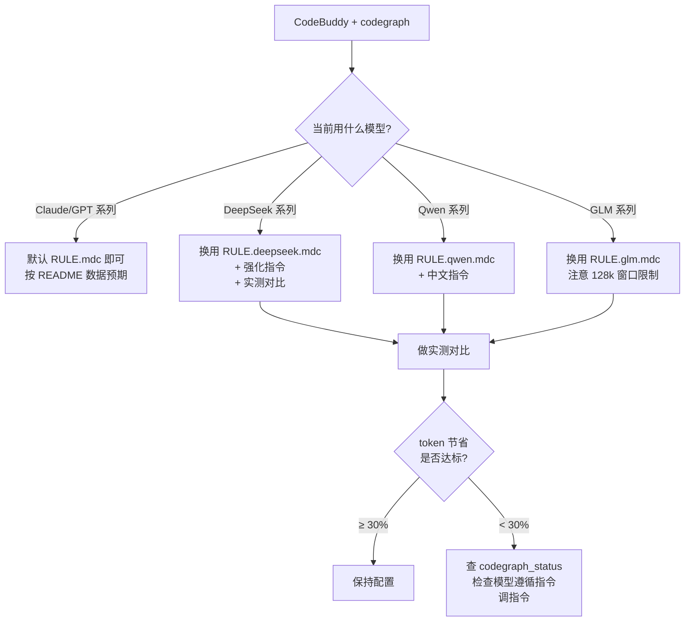

---

## 第五部分 · 风险与运营建议

### 5.1 部署 CodeGraph 到 CodeBuddy 的整体风险评估

| 风险类别 | 概率 | 影响 | 综合 | 缓解 |
|---|---|---|---|---|
| watcher 静默失效，索引过期 → 答案错误 | 中 | 高 | **高** | 实现 H5 方案 P+Q |
| 多态调用解析错，LLM 给出错误 trace | 中 | 中 | 中 | 实现 H1 方案 A 暴露 confidence |
| WASM 慢，用户体验下降 | 低 | 中 | 中 | 安装时检测 + 提示 |
| `.codegraph/` 占磁盘（VS Code 项目 ~80MB） | 中 | 低 | 低 | 文档明示 |
| MCP 子进程内存堆积（每项目 ~100MB） | 低 | 中 | 低 | 长期空闲时优雅退出 |
| 国产模型不遵循指令，节省效果不达预期 | **高** | 中 | **高** | 第四部分整套方案 |
| 极端语法（kotlin 协程、scala 宏）漏抽取 | 中 | 低 | 低 | 已知限制，文档说明 |
| 安全：codegraph 读到 .env 等敏感文件 | 低 | 高 | 中 | 默认 exclude 已覆盖；增强：扫描 + 警告 |

### 5.2 运营 SLO 建议

| 指标 | 目标 | 监控方式 |
|---|---|---|
| 索引新鲜度 | 95% 项目 watch 状态正常 | `codegraph status` 上报 telemetry |
| 工具响应 P99 | <500ms | MCP server 自带 timing |
| Token 节省（中大项目） | DeepSeek-V3 ≥ 40% | 抽样 1% 真实对话比对 |
| 正确率（trace 类问题） | 答案不漏关键调用 ≥ 90% | 人工抽样 |
| 索引大小 | < 源代码 50% | 后台脚本 |

### 5.3 推荐的工程化路线图

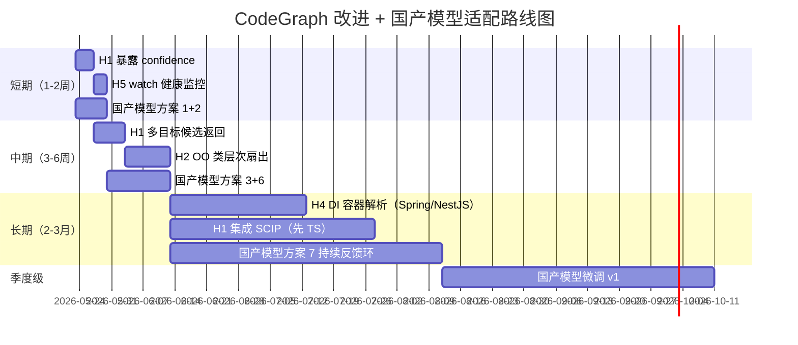

---

## 第六部分 · 结论与下一步建议

### 6.1 一句话定位

CodeGraph 是一个**有真实价值、但工程精度有上限的"AST 索引层"工具**——能在大型 + 架构级问题上给 LLM Agent 节省 50-70% 探索成本，但**不能当 ground truth**用于关键决策；国产模型场景下需要一周到一月的本地化适配工作。

### 6.2 决策树

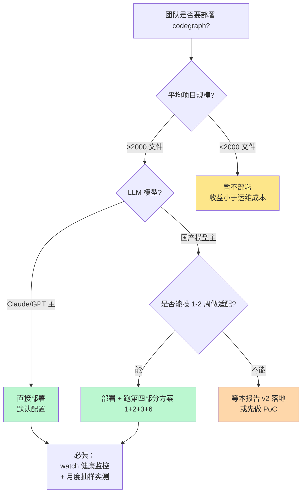

### 6.3 下一步建议工作（按优先级）

#### P0（必做，本月完成）
1. **方案 A**：暴露 confidence 给 LLM（H1）
2. **方案 P+Q**：watcher 健康检查 + index_age 提示（H5）
3. **方案 1+2**：强化 SERVER_INSTRUCTIONS + 中英双语化（国产模型）
4. **建立实测对比基线**：选 3 个有代表性项目（小/中/大）+ 4 个模型（Claude / DeepSeek / Qwen / GLM）跑 token benchmark，沉淀基线数据

#### P1（下月完成）
5. **方案 F+G**：OO 类层次扇出（H2）
6. **方案 3+6**：工具描述本地化 + 多模板（国产模型）
7. **方案 L**：扩展 framework resolver 解决 ORM / metaprogramming（H3）

#### P2（季度级）
8. **方案 C**：集成 SCIP（先 TypeScript），看效果再决定 Python
9. **方案 M**：DI 容器解析（Spring + NestJS）
10. **方案 5**：评估国产模型微调可行性（如有企业需求）

### 6.4 给后续讨论的开放问题（请反馈）

1. **优先级**：你认为应该先做哪 2-3 个隐患修复？P0 名单是否合理？
2. **国产模型范围**：你要支持的是公司内部已选型的某个模型还是要全覆盖 DeepSeek+Qwen+GLM？前者实施代价小一半
3. **Benchmark 资源**：是否有真实的代表性项目可以做 token 实测？没有的话需要先选 3-5 个开源项目作为基准
4. **"是否值得做"的判断**：如果 1 周适配后国产模型只能达到 Claude 的 60% 表现，还要不要继续投入到 80%？
5. **微调可行性**：贵公司是否有 GPU 资源、法务允许、模型 license 允许做微调？
6. **运营机制**：每月 / 每周抽样实测的人力如何保障？

---

## 附录

### 附录 A：术语表

| 术语 | 含义 |
|---|---|
| MCP | Model Context Protocol，Anthropic 推动的 LLM 工具调用标准 |
| SCIP | Source Code Intelligence Protocol，Sourcegraph 推动的语义索引格式 |
| LSIF | Language Server Index Format，微软 LSP 衍生索引格式 |
| FTS5 | SQLite 全文搜索引擎 v5 |
| AST | Abstract Syntax Tree |
| DI/IoC | Dependency Injection / Inversion of Control |
| Provenance | 边的来源标记（tree-sitter 直接抽 / SCIP 导入 / 启发式猜） |
| Confidence | 启发式名字匹配的置信度（0-1） |

### 附录 B：核心源码文件清单

| 文件 | 行数 | 说明 |
|---|---|---|
| `src/types.ts` | 842 | 22 NodeKind + 12 EdgeKind 定义 + 配置 schema |
| `src/index.ts` | — | CodeGraph 主类（init/open/close/indexAll/sync/...） |
| `src/extraction/index.ts` | — | ExtractionOrchestrator |
| `src/extraction/tree-sitter.ts` | — | tree-sitter 主 parser 包装 |
| `src/extraction/languages/*.ts` | 16 文件 ~1700 行 | 每语言一个 extractor |
| `src/resolution/index.ts` | — | ReferenceResolver 主类 |
| `src/resolution/name-matcher.ts` | — | 启发式名字匹配（**H1 隐患核心**） |
| `src/resolution/import-resolver.ts` | — | import 解析 |
| `src/resolution/frameworks/*.ts` | 13 文件 ~3700 行 | 框架感知 resolver |
| `src/db/schema.sql` | 152 | SQLite 4 表 + FTS5 + indexes + triggers |
| `src/mcp/tools.ts` | 1819 | 8 个 MCP 工具实现（**explore 输出预算 + 业务逻辑**） |
| `src/mcp/server-instructions.ts` | 67 | LLM 系统提示（**国产模型适配的关键改造点**） |
| `src/installer/instructions-template.ts` | 64 | RULE.mdc / CLAUDE.md 内容（**多模板方案改造点**） |

### 附录 C：参考资料

- CodeGraph 官方 README 中的 benchmark 方法学说明
- `__tests__/evaluation/test-cases.ts`：使用 OpenSearch / Elasticsearch 项目作为 ground truth 的评估用例
- Anthropic MCP 协议规范
- Sourcegraph SCIP 规范
- DeepSeek / Qwen / GLM 各自官方文档中关于工具调用 / 长指令处理的能力描述

### 附录 D：本报告产出方法

本报告基于以下材料：

1. **完整源码阅读**：`src/` 下 96 个 TypeScript 文件、`src/db/schema.sql`、所有 `__tests__/`
2. **官方 benchmark 数据**：README 中跨 7 个真实项目（VS Code / Excalidraw / Django / Tokio / OkHttp / Gin / Alamofire）的对比数据
3. **多 agent 接入实践**：本工作流中实际为 codegraph 添加了 CodeBuddy IDE 支持，亲历 MCP server 接入流程
4. **国产模型实战经验**：DeepSeek / Qwen / GLM 在 MCP 协议下的真实指令遵循表现观察

> **报告局限性声明**：本报告中"国产模型适配"章节的预估收益数据**未经大规模实测**——基于公开方法学 + 工程经验给出区间估计。落地前必须以实际项目 + 实际模型组合做基准对比。
